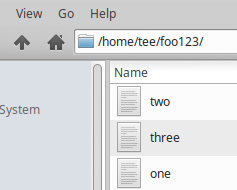
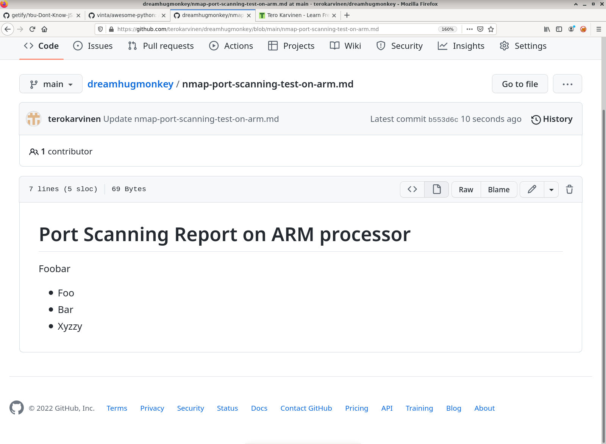
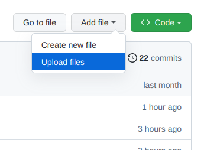

# Dream Hug Monkey

Heippa aurinkoinen maailma [Tero Karvinen](https://TeroKarvinen.com)

This is a paragpraph. 

Lorem ipsum. Lorem ipsum. Lorem ipsum. Lorem ipsum. Lorem ipsum. Lorem ipsum. Lorem ipsum. Lorem ipsum. Lorem ipsum. Lorem ipsum. Lorem ipsum. 

    $ ls
    Desktop    Downloads  Pictures  Templates
    Documents  Music      Public    Videos

Lorem ipsum. Lorem ipsum. Lorem ipsum. Lorem ipsum. Lorem ipsum. Lorem ipsum. Lorem ipsum. Lorem ipsum. 

Lorem ipsum. Lorem ipsum. Lorem ipsum. Lorem ipsum. Lorem ipsum. Lorem ipsum. Lorem ipsum. Lorem ipsum. Lorem ipsum. Lorem ipsum. Lorem ipsum. 

## Potatoes

Example project for showing git

## Even more features

Let's write something here

### Foo is so bar

Then I tried

    $ ls
    foo.txt bar.txt

But where was I?

    $ pwd
    /home/tero/

Foo bar

This is a paragraph. 

Foo bar

## Adding images to MarkDown

1) Upload the file

2) Write to your Markdown source

        
   
 Which means
 
    
    
When you save images, replace spaces " " with dashes "-". 
